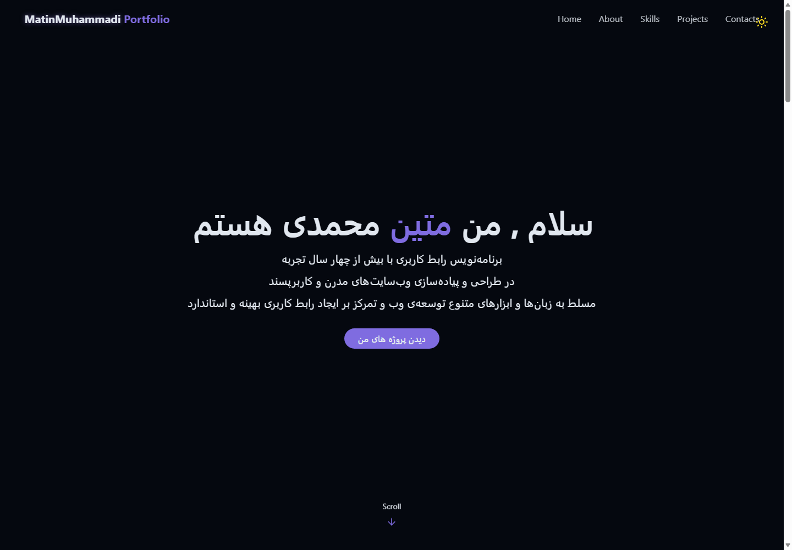
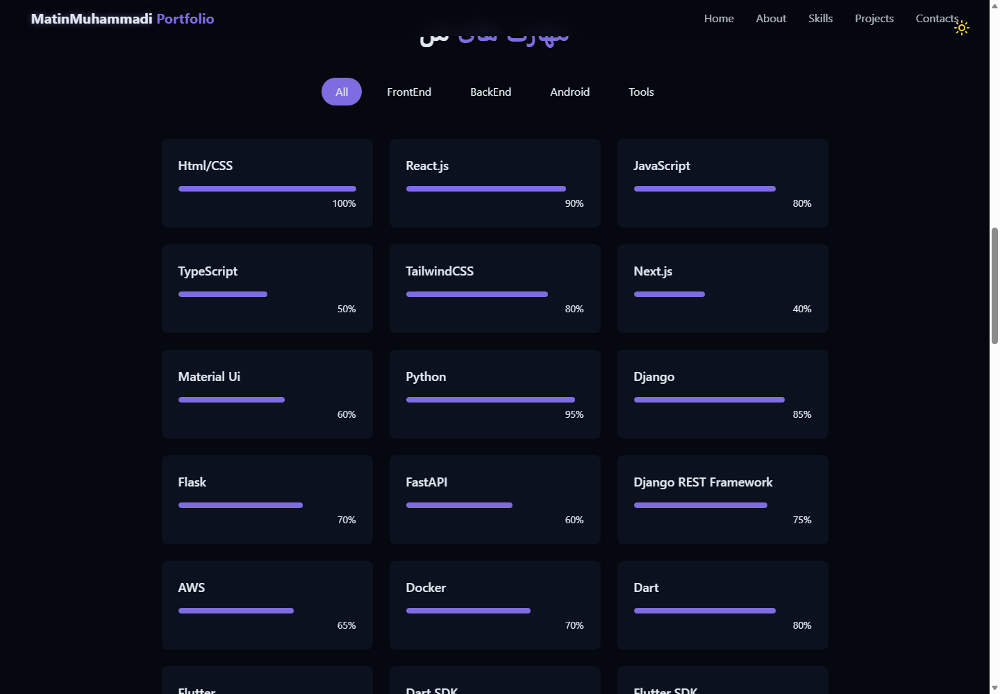
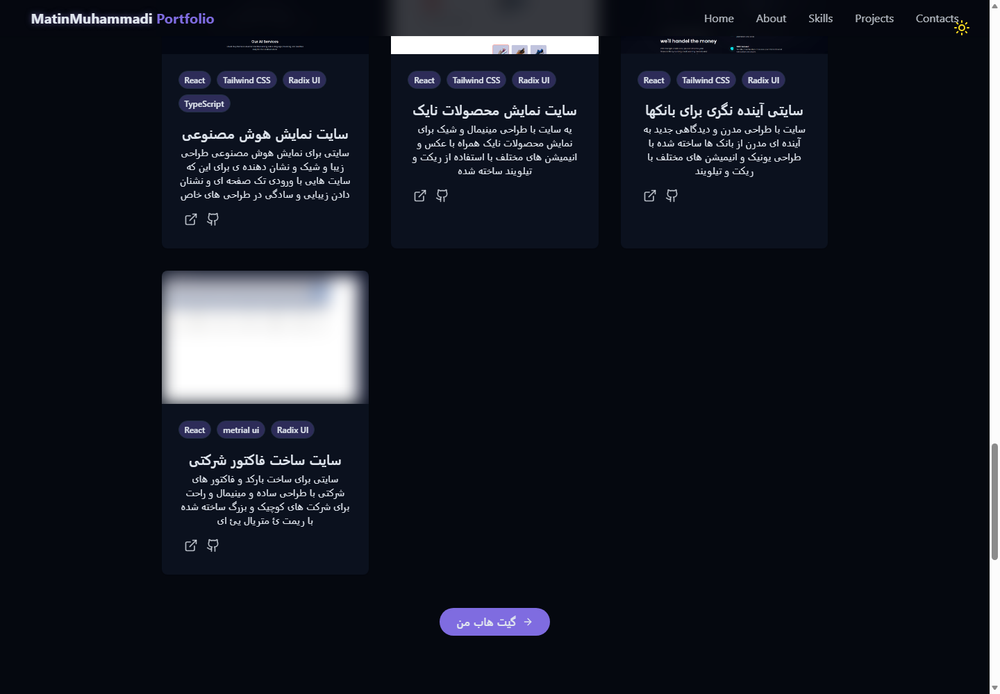

# Matin Portfolio

**English** · [فارسی](#فارسی)

A responsive personal portfolio website for Matin Muhammadi, focused on modern web development, front-end engineering, and visual interface design.

## Screenshots

**Portfolio introduction · معرفی**

**Skills · مهارت‌ها**

**Selected projects · پروژه‌های منتخب**

## Features

- About section with experience and resume download
- Project showcase with images, technology tags, demos, and repository links
- Filterable skills section with front-end, back-end, mobile, and tooling categories
- Contact section and social links
- Responsive navigation and footer
- Theme toggle and animated visual background
- Not-found page for unsupported routes
- GitHub Pages deployment configuration

## Tech Stack

- React 19
- Vite
- Tailwind CSS 4
- React Router
- Lucide React
- Radix UI Toast
- JavaScript (JSX)

## Getting Started

~~~bash
git clone https://github.com/MatinMuhammadi1381/Matin_portfolio.git
cd Matin_portfolio
npm ci
npm run dev
~~~

Open the local URL shown by Vite, usually http://localhost:5173.
On Windows, `INSTALL-DEPENDENCIES.bat` installs the exact dependencies from the lockfile.

## Available Scripts

~~~bash
npm run dev       # Start the development server
npm run build     # Create a production build
npm run preview   # Preview the production build
npm run deploy    # Build and publish to GitHub Pages
~~~

## Live Demo

[Open the portfolio](https://MatinMuhammadi1381.github.io/Matin_portfolio)

## Project Structure

~~~text
src/
├── components/   # Portfolio sections and reusable UI
├── pages/        # Page-level views
├── hooks/        # Reusable React hooks
├── lib/          # Utility helpers
├── App.jsx       # Application shell
└── main.jsx      # Application entry point
~~~

## Notes

Project cards and resume links are configured in the source code and point to the demos and assets included with the portfolio.

---

## فارسی

یک وب‌سایت واکنش‌گرا برای معرفی مهارت‌ها و پروژه‌های برنامه‌نویسی و طراحی رابط کاربری.

### امکانات

- معرفی کوتاه، مهارت‌ها و سوابق
- نمایش پروژه‌ها همراه با تصویر، فناوری‌ها و پیوندهای مربوط
- دسته‌بندی مهارت‌ها و تغییر پوستهٔ صفحه
- بخش راه‌های ارتباطی و نمایش مناسب در اندازه‌های مختلف

### تصاویر

سه تصویر بالا به‌ترتیب صفحهٔ آغازین، مهارت‌ها و پروژه‌های منتخب را نشان می‌دهند.

### فناوری‌ها

React 19، Vite، Tailwind CSS 4، React Router، Lucide React، Radix UI و JavaScript.

### راه‌اندازی

به Node.js نسخهٔ ۲۰ یا بالاتر نیاز است. در ویندوز فایل `INSTALL-DEPENDENCIES.bat` را اجرا کنید؛ یا این فرمان‌ها را اجرا کنید:

~~~bash
npm ci
npm run dev
~~~

نشانی محلی را Vite نمایش می‌دهد (معمولاً `http://localhost:5173`). برای ساخت نسخهٔ نهایی از `npm run build` و برای پیش‌نمایش از `npm run preview` استفاده کنید.

### ساختار پروژه

بخش‌های اصلی در `src/components/`، صفحهٔ اصلی در `src/pages/` و فایل‌های تصویری و رزومه در `public/` قرار دارند.